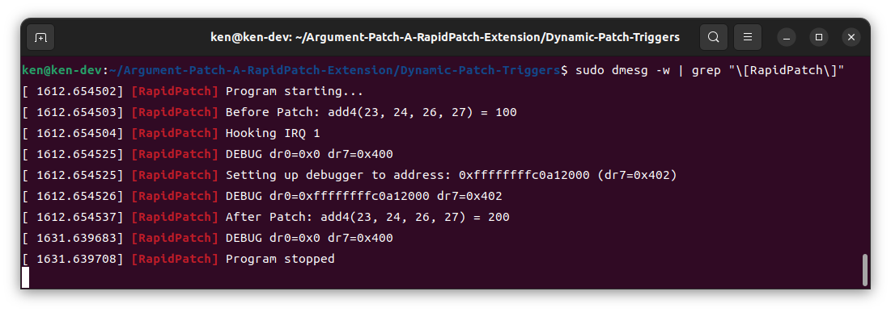

# What is This Project
This is an implementation for the seminar WS2223 in TUM (Technical University of Munich) about Operating Systems and Virtualization by the chair DSE (Distributed Systems & Operating Systems).

In this project, we are showing the possibility to improve the original **RapidPatch** research done by Yi He et. al. reducing the space complexity, risks of making defected patches and increasing the availability of RapidPatch's code correctness verifier "Patch Verifier" by introducing a new patching model `Argumented Patch` (Detail please refer to the [paper](./Extension%20of%20RapidPatch's%20Patching%20Model%3A%20%E2%80%9EArgument%20Patch%E2%80%9C%20and%20Possible%20RapidPatch%20Application%20on%20Closed-Source%20Projects.pdf)).

RapidPatch is a hot-patching framework aiming to solve the enormous patching delay and reduce the risk of deploying patches to running systems. More details can be found over [here](https://www.usenix.org/conference/usenixsecurity22/presentation/he-yi)

All the codes in this repo are tested under Ubuntu 22.04 on an AMD Zen3 processor (x86_64).

# How to Start 
## What you need
You can find 2 folders in the project, which are:
1. Fixed Patch Tiggers
   - Tools You Need
      - cmake
      - make
      - GCC

   1. `sudo apt install -y build-essential cmake` to install dependencies needed if you are an Ubuntu user.

   2. You can use the following command to build the code: 
      ```
      mkdir build
      cd build
      cmake ..
      make
      ```

   3. And then the demo can be started with the command:
      ```
      ./FixedPatchTrigger
      ```
   4. Result:
      

2. Dynamic Patch Triggers

   `!! We strongly recommend you build and run this demo under a virtual machine !!`

   If you disabled secure boot on your virtual machine, you can jump directly to step 4.
   1. Create a keypair to sign the kernel module following commands: 
      ```
      mkdir sign
      openssl req -new -x509 -newkey rsa:2048 -keyout sign/MOK.priv -outform DER -out sign/MOK.der -days 36500 -subj "/CN=My Name/" -nodes
      ```
   2. Enroll the key created, there you will be prompted for a password: `sudo mokutil --import sign/MOK.der`

   3. Reboot and enroll the key with password you picked in step 2.

   4. Install required dependencies:
      `sudo apt install -y build-essential linux-headers-$(uname -r)`

   5. Build with command `./build.sh`
   6. Start 2 different window, one starts with command: `sudo dmesg -w | grep "\[RapidPatch\]"`; 
   
      the other with: `sudo insmod build/RapidPatch.ko`

   7. You can find results printed on the first window:
      
      
   8. Remove the kernel mode we used for demonstration with: `sudo rmmod RapidPatch`

# What We Want to Achieve
We would like to show that our concept (Argument Patch) is working with RapidPatch's patch trigger models: Fixed Patch Tiggers and Dynamic Patch Triggers.

In the demo, given illustrative vulnerable function is the function `add4` which simply adds 4 integers given and returns the result by adding all of them.

As the demonstration, when the patch is triggered, the second argument will be intentionally added with a 100 making the result 100 more than the normal result.